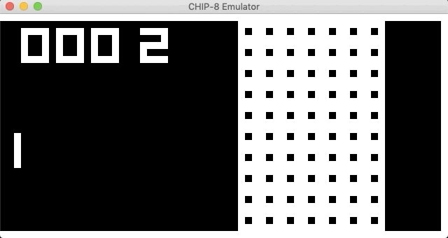

# CHIP-8 Emulator

This repository contains my [CHIP-8](https://en.wikipedia.org/wiki/CHIP-8) emulator.



## Implementation

I wrote the emulator and assembler in C# targeting the cross-platform [.NET Core](https://dotnet.microsoft.com/) runtime. I'm using [SDL2](https://www.libsdl.org/) for the GUI.

While the CHIP-8 did not have an officially defined "assembly" language, I did end up writing an assembler to make it easier to write programs for the emulator's unit test suite.

## Compiling / Running

1. Install [.NET Core](https://dotnet.microsoft.com/download)
2. Clone this repository
3. `cd emulator`
4. `dotnet restore`
5. `dotnet run --` followed by the commands to pass to the CLI program

Currently there is only one command, `run`:

```
$ dotnet run -- run --help

Usage: c8emu run [arguments] [options]

Arguments:
  [ROM path]  The path to a ROM file to load.

Options:
  -?|-h|--help     Show help information
  -s|--speed       Controls how fast the emulator should run (100 = max, 1 = min, 50 = default)
  -d|--debug       Run in debug mode; Space Bar = Break, F10 = Step, F5 = Continue
  -b|--break       Breakpoint on startup; requires debug option to function.
  -p|--perfmon     Performance monitor; write stats to the console while running.
  -ko|--keep-open  Keep the GUI open even if the emulator finishes ROM execution.
```

For example: `dotnet run -- run ~/game.ROM --debug --speed 75`

While the assembler is mainly used for unit tests, it can be run from the command line as well:

1. `cd assembler`
2. `dotnet restore`
3. `dotnet run --` followed by the commands to pass to the CLI program

Currently there is only one command, `assemble`:

```
$ dotnet run -- assemble --help

Usage: c8asm assemble [arguments] [options]

Arguments:
  [source path]  The path to a source file to assemble; will assemble the ROM in the same location with a .ROM extension.

Options:
  -?|-h|--help  Show help information
  -o|--output   An override for the path where the ROM file should be written.
```

For exmaple: `dotnet run -- assembler ~/game.src --output ~/game.ROM`

## Debugger

If the emulator is launched with the `--debug` option, the debugger will be enabled. In this mode space bar breaks on the current opcode, F10 steps over a single opcode, and F5 resumes normal operation. After each single step (F10) the state of the registers and program counter will be written to the console.

To break immediately upon launching a ROM, add the `--break` option as well.

## Unit Tests

While building the emulator I found it useful to write unit tests for each opcode along the way. This made it much easier to track down bugs late in development.

1. `cd emulator.tests`
2. `dotnet restore`
3. `dotnet test`

There are also tests for the assembler in the `assembler.tests` directory.

## Resources

I found the following resources useful in building this emulator:

* [How to write an emulator (CHIP-8 interpreter)](http://www.multigesture.net/articles/how-to-write-an-emulator-chip-8-interpreter/) (great getting started guide)
* [Cowgod's Chip-8 Technical Reference](http://devernay.free.fr/hacks/chip8/C8TECH10.HTM) (opcode info)
* [Mastering Chip-8 By Matthew Mikolay](http://mattmik.com/files/chip8/mastering/chip8.html) (opcode info)
* [Craig Thomas' Mnemonic list](https://github.com/craigthomas/Chip8Assembler#mnemonic-table) (used for my assembler for the emulator unit tests)
* [massung's CHIP-8 emulator binary](https://github.com/massung/CHIP-8/releases) (great debugger for verifying my opcode implementations)
* [Public domain ROMs](https://www.zophar.net/pdroms/chip8.html)
* [ROMs and their source code](https://github.com/badlogic/chip8/tree/master/roms)
